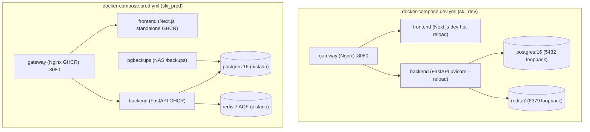

# Analisis Integral de Docker Compose (Desarrollo y Produccion)

Este documento recoge el analisis tecnico y operativo exhaustivo de los manifiestos Docker Compose del proyecto **saas-ski-portal**: `docker-compose.dev.yml` y `docker-compose.prod.yml`.

---

## 1. Resumen Ejecutivo y Arquitectura

El sistema utiliza una arquitectura de microservicios contenerizados desacoplados en torno a un Gateway unificado (Nginx) como punto de entrada unico, separando el trafico web del frontend y el enrutamiento de la API backend, con aislamiento estricto de la base de datos y cache en una red interna.

---

## 2. Analisis de docker-compose.dev.yml (Entorno de Desarrollo)

### 2.1. Servicios y Proposito
- **gateway**: Proxy inverso Nginx 1.25 Alpine que atiende peticiones publicas en el host. Enruta el frontend (`/`), la API (`/api/`), el endpoint de salud (`/health`) y los WebSockets de Hot Module Replacement (HMR).
- **frontend**: Aplicacion Next.js 16 / React 19 ejecutandose en modo desarrollo (`next dev`).
- **backend**: API REST en FastAPI / Python 3.12 ejecutandose bajo Uvicorn con recarga automatica de codigo (`--reload`).
- **postgres**: Servidor PostgreSQL 16 Alpine con almacenamiento persistente local.
- **redis**: Servidor en memoria Redis 7 Alpine para cache, rate limiting y sesiones.

### 2.2. Puertos y Variables de Entorno
- **Gateway**: `"${GATEWAY_PORT:-8080}:80"` expuesto en todas las interfaces de red del host (`0.0.0.0`).
- **Postgres**: `"127.0.0.1:${POSTGRES_PORT:-5432}:5432"` mapeado exclusivamente al loopback local, impidiendo exposicion externa y facilitando la depuracion con clientes SQL (DBeaver, psql) o migraciones en host.
- **Redis**: `"127.0.0.1:${REDIS_PORT:-6379}:6379"` mapeado a `127.0.0.1`.
- **Backend / Frontend**: Sin puertos expuestos al host; consumidos unicamente de forma interna a traves de la red bridge de aplicacion.
- **Parametrizacion Multi-Worktree**: La variable `${COMPOSE_PROJECT_NAME:-ski_dev}` permite levantar multiples instancias aisladas en paralelo en la misma maquina.

### 2.3. Gestion de Volumenes y Compatibilidad SELinux
1. `postgres_data:/var/lib/postgresql/data:z`: Named volume gestionado para persistir la BD entre reinicios.
2. `./backend:/app:z`: Bind mount local para auto-recarga reactiva del codigo Python.
3. `./frontend:/app:z`: Bind mount local para auto-recarga de componentes React / Next.js.
4. `/app/node_modules` y `/app/.next`: Volumenes anonimos que previenen la sobreescritura de dependencias y caches compiladas del contenedor por los directorios del host.
5. `./gateway/nginx.dev.conf:/etc/nginx/nginx.conf:ro,z`: Montaje en solo lectura para aplicar ajustes del gateway en caliente.
6. **Banderas `:z`**: Presentes en todos los montajes para garantizar compatibilidad con SELinux y ejecucion en Podman rootless sin problemas de permisos.

### 2.4. Targets de Construccion y Healthchecks
- **Frontend**: Utiliza el target `target: deps` del Dockerfile, instalando unicamente paquetes con `npm ci --legacy-peer-deps` y ejecutando `npm run dev`.
- **Backend**: Utiliza base `python:3.12-slim` con comando `uvicorn main:app --host 0.0.0.0 --port 8000 --reload`.
- **Healthchecks coordinados**:
  - `postgres`: `pg_isready -U ${POSTGRES_USER:-postgres} -d ${POSTGRES_DB:-postgres}`.
  - `redis`: `redis-cli ping`.
  - `backend`: `python3 -c "import urllib.request; urllib.request.urlopen('http://127.0.0.1:8000/health')"`.
  - El frontend y el gateway aguardan a que el backend este saludable antes de recibir trafico.

---

## 3. Analisis de docker-compose.prod.yml (Entorno de Produccion)

### 3.1. Servicios y Proposito
1. **postgres** (`postgres:16-alpine`): Almacenamiento relacional principal aislado en la red interna de persistencia.
2. **redis** (`redis:7-alpine`): Cache y control de sesiones con persistencia AOF habilitada (`--appendonly yes`) y memoria maxima parametrizable (`--maxmemory ${REDIS_MAXMEMORY:-256mb}`).
3. **backend** (`ghcr.io/hugovelez16/saas-ski-portal/backend:${IMAGE_TAG:-latest}`): API FastAPI en contenedor inmutable.
4. **frontend** (`ghcr.io/hugovelez16/saas-ski-portal/frontend:${IMAGE_TAG:-latest}`): Frontend Next.js compilado en modo `standalone` con Node.js 20 Alpine y usuario sin privilegios `nextjs:nodejs`.
5. **gateway** (`ghcr.io/hugovelez16/saas-ski-portal/gateway:${IMAGE_TAG:-latest}`): Proxy inverso Nginx con configuracion productiva compilada dentro de la imagen.
6. **pgbackups** (`prodrigestivill/postgres-backup-local`): Servicio autonomo para copias de seguridad automaticas y rotativas de PostgreSQL (`@daily`, retencion 7 dias, 4 semanas, 3 meses) hacia almacenamiento persistente o NAS.

### 3.2. Puertos y Seguridad de Red
- **Unico puerto expuesto**: `"${GATEWAY_PORT:-8080}:80"`.
- **Aislamiento Total**: Ni Postgres (5432), ni Redis (6379), ni Backend (8000), ni Frontend (3000) exponen puertos al host.
- **Redes Segmentadas**:
  - `prod_app`: Red de comunicacion web (`gateway` <-> `frontend` <-> `backend`).
  - `prod_db`: Red interna con flag `internal: true`. Conecta exclusivamente `backend`, `postgres`, `redis` y `pgbackups`, sin salida externa a internet.
- **Terminacion SSL/TLS**: El gateway atiende en HTTP plano (puerto 80); la terminacion HTTPS y renovacion de certificados Let's Encrypt se gestiona externamente mediante proxy perimetral (Caddy/Nginx) y tunel seguro.

### 3.3. Gestion de Volumenes y Persistencia
- `postgres_data:/var/lib/postgresql/data:z`: Named volume para persistencia de la base de datos.
- `redis_data:/data:z`: Named volume para almacenar los registros de transacciones AOF de Redis.
- `${BACKUP_DIR:-/mnt/nas_backups/clases-vesotel}:/backups:z`: Bind mount hacia almacenamiento NAS para copias de seguridad de PostgreSQL.
- Sin bind mounts de codigo fuente: Las imagenes son selladas, inmutables y trazables con etiquetas SemVer (`IMAGE_TAG`).

---

## 4. Matriz Comparativa Detallada

| Caracteristica | Desarrollo (`docker-compose.dev.yml`) | Produccion (`docker-compose.prod.yml`) |
| :--- | :--- | :--- |
| **Proyecto / Namespace** | `${COMPOSE_PROJECT_NAME:-ski_dev}` | `${COMPOSE_PROJECT_NAME:-ski_prod}` |
| **Origen de Imagenes** | Construccion local (`build:`) | Registro GHCR (`ghcr.io/...:${IMAGE_TAG}`) |
| **Target Frontend** | `deps` (`npm run dev`) | `runner` (Next.js standalone compilado) |
| **Modo Backend** | Uvicorn con `--reload` | Uvicorn estandar de produccion |
| **Puertos BD / Redis** | Expuestos en `127.0.0.1` | Cerrados (comunicacion interna exclusiva) |
| **Copias de Seguridad** | No presentes | Servicio dedicado `pgbackups` con retencion |
| **Persistencia Redis** | Efimera / RAM | Persistencia en disco AOF (`appendonly yes`) |
| **Configuracion Nginx** | Montada en caliente (`nginx.dev.conf`) | Compilada dentro de la imagen (`nginx.conf`) |
| **Manejo de Permisos** | Banderas `:z` para SELinux/Podman | Banderas `:z` para SELinux/Podman |

---

## 5. Donde y Como se Utilizan en el Proyecto

### Scripts Locales en `./bin/`
- `bin/dev`: Valida `.env` y ejecuta `docker compose -f docker-compose.dev.yml up -d --build`.
- `bin/stop`: Detiene contenedores con `docker compose -f docker-compose.dev.yml down`.
- `bin/logs`: Muestra logs en tiempo real con `docker compose -f docker-compose.dev.yml logs -f`.
- `bin/migrate`: Ejecuta `alembic upgrade head` dentro de un contenedor backend efimero:
  `docker compose -f docker-compose.dev.yml run --rm backend python3 -m alembic upgrade head`
- `bin/seed`: Ejecuta el sembrado de datos en el backend:
  `docker compose -f docker-compose.dev.yml run --rm backend python3 -c "import seed; seed.seed_initial_data()"`

### Scripts de Sincronizacion y Mantenimiento en `./scripts/`
- `scripts/sync_db.sh`: Realiza un volcado `pg_dump` desde un contenedor/servidor remoto y lo restaura en el contenedor local `${COMPOSE_PROJECT_NAME}-postgres`.

### Atajos en `package.json`
- `npm run dev` -> `./bin/dev`
- `npm run docker:dev` -> `docker compose -f docker-compose.dev.yml up -d --build`
- `npm run docker:dev:down` -> `docker compose -f docker-compose.dev.yml down`
- `npm run docker:dev:logs` -> `docker compose -f docker-compose.dev.yml logs -f`

### Despliegue en Produccion (Komodo / GitOps)
- Komodo o los runners de despliegue ejecutan `docker compose -f docker-compose.prod.yml pull`, aplican migraciones con Alembic y levantan la nueva version mediante `up -d`.

---

## 6. Observaciones Tecnicas y Recomendaciones de Mejora

1. **Workers de Uvicorn en Produccion**:
   - Actualmente `backend/Dockerfile` inicia Uvicorn con un solo worker. Para maximizar el rendimiento multinucleo en produccion, se recomienda parametrizar `--workers ${WEB_CONCURRENCY:-2}`.
2. **Politica de Rotacion de Logs**:
   - Se recomienda anadir bloques de `logging` en los servicios de produccion para limitar el tamano maximo de logs en disco (`max-size: "20m"`, `max-file: "5"`).
3. **Limites de Recursos (Memory / CPU Limits)**:
   - Declarar directivas `deploy.resources.limits` en `postgres`, `backend` y `frontend` dentro del compose de produccion para proteger el servidor host contra situaciones de Out-Of-Memory (OOM).
