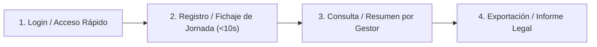

# Plan de Implementación: PostHog Analytics & Estrategia Anti-Overengineering

**Proyecto:** Vesotel Gestor Jornada (`clases.vesotel.com`)  
**Fecha:** Octubre 2026  
**Estado:** Listo para ejecución  

---

## 1. Contexto y Diagnóstico del Producto

### Situación Actual
* SaaS multi-empresa para la gestión de jornadas laborales y registros de trabajo (*Work Logs*).
* Arquitectura: Next.js (App Router) + FastAPI + PostgreSQL 16 + Redis + Docker + CI/CD (GitHub Actions + GHCR + Komodo).
* **Problema identificado:** Gran cantidad de pantallas y módulos desarrollados o a medio desarrollar (`admin/modules`, `manager/shifts`, `billing`, `reports/print`, `calendar`, etc.) con pocos usuarios activos reales, lo que genera **riesgo alto de overengineering y dispersión**.

### Decisión de Analítica: ¿Por qué PostHog Cloud sobre Plausible?
1. **Fase temprana (Pocos usuarios):** Las métricas estadísticas agregadas de Plausible (visitas, países, referrers) aportan poco valor con muestras pequeñas.
2. **El factor diferencial (*Session Replay*):** PostHog permite ver **grabaciones en vídeo reales** del uso de la app. Permite identificar fricciones en UX (*rage clicks*, dudas, abandonos en formularios de login o fichaje).
3. **Plan Gratuito Generoso:** 1.000.000 de eventos/mes y 5.000 grabaciones de sesión/mes sin coste de infraestructura ni mantenimiento de bases de datos adicionales.
4. **Respeto a la Privacidad (RGPD):** Servidores en la Unión Europea (`eu.i.posthog.com`) y enmascaramiento automático de campos de texto sensibles (*maskAllInputs*).

---

## 2. El Core Value Loop (Foco Único de Producto)

Para salir del bucle de desarrollo a ciegas, se congela el desarrollo de funcionalidades secundarias hasta que el flujo principal esté validado mediante analítica real:



* **Regla de Oro:** Si una nueva idea o mejora no impacta directamente en que los pasos 1, 2, 3 o 4 sean más rápidos o fiables, **no se programa hasta ver grabaciones reales de usuarios solicitándolo**.

---

## 3. Plan de Implementación Técnica (Paso a Paso)

### Fase A: Configuración en PostHog y GitHub Secrets

1. **Crear cuenta en PostHog Cloud (EU):**
   * Registro en [eu.posthog.com](https://eu.posthog.com).
   * Crear proyecto "Vesotel Clases".
   * Copiar la **Project API Key** (`phc_...`).

2. **Añadir secreto en el repositorio GitHub:**
   * Ruta: `https://github.com/tu-usuario/saas-ski-portal/settings/secrets/actions`
   * Secreto: `NEXT_PUBLIC_POSTHOG_KEY` = `phc_xxxxxxxxxxxxxxxxx`

---

### Fase B: Modificación del CI/CD y Docker (Inyección en Build-Time)

Next.js requiere que las variables `NEXT_PUBLIC_*` estén disponibles en tiempo de compilación dentro del contenedor Docker (`builder`).

#### 1. `frontend/Dockerfile`
```dockerfile
# Argumentos de construcción para variables NEXT_PUBLIC
ARG NEXT_PUBLIC_API_URL
ARG NEXT_PUBLIC_POSTHOG_KEY
ARG NEXT_PUBLIC_POSTHOG_HOST

ENV NEXT_PUBLIC_API_URL=${NEXT_PUBLIC_API_URL}
ENV NEXT_PUBLIC_POSTHOG_KEY=${NEXT_PUBLIC_POSTHOG_KEY}
ENV NEXT_PUBLIC_POSTHOG_HOST=${NEXT_PUBLIC_POSTHOG_HOST}
```

#### 2. `.github/workflows/deploy-prod.yml`
```yaml
      - name: Compilar y Publicar Imagen Frontend
        uses: docker/build-push-action@v5
        with:
          context: ./frontend
          file: ./frontend/Dockerfile
          push: true
          build-args: |
            NEXT_PUBLIC_API_URL=/api
            NEXT_PUBLIC_POSTHOG_KEY=${{ secrets.NEXT_PUBLIC_POSTHOG_KEY }}
            NEXT_PUBLIC_POSTHOG_HOST=https://eu.i.posthog.com
          tags: |
            ${{ env.IMAGE_BASE }}/frontend:latest
            ${{ env.IMAGE_BASE }}/frontend:v${{ needs.get-version.outputs.version }}
```

#### 3. `.github/workflows/deploy-dev.yml`
```yaml
      - name: Compilar y Publicar Imagen Frontend
        uses: docker/build-push-action@v5
        with:
          context: ./frontend
          file: ./frontend/Dockerfile
          push: true
          build-args: |
            NEXT_PUBLIC_API_URL=/api
            NEXT_PUBLIC_POSTHOG_KEY=${{ secrets.NEXT_PUBLIC_POSTHOG_KEY }}
            NEXT_PUBLIC_POSTHOG_HOST=https://eu.i.posthog.com
          tags: |
            ${{ env.IMAGE_BASE }}/frontend:dev-latest
            ${{ env.IMAGE_BASE }}/frontend:dev-v${{ needs.get-version.outputs.version }}
```

---

### Fase C: Integración en Frontend (Next.js)

#### 1. Instalar dependencia
```bash
cd frontend
npm install posthog-js
```

#### 2. Actualizar `frontend/src/components/providers.tsx`
```tsx
"use client";

import { QueryClient, QueryClientProvider } from "@tanstack/react-query";
import { useEffect } from "react";
import { Toaster as SonnerToaster } from "sonner";
import { Toaster } from "@/components/ui/toaster";
import posthog from "posthog-js";
import { PostHogProvider } from "posthog-js/react";

// (Query client singleton existente)
// ...

export function Providers({ children }: { children: React.ReactNode }) {
  const queryClient = getQueryClient();

  useEffect(() => {
    if (typeof window !== "undefined" && process.env.NEXT_PUBLIC_POSTHOG_KEY) {
      posthog.init(process.env.NEXT_PUBLIC_POSTHOG_KEY, {
        api_host: process.env.NEXT_PUBLIC_POSTHOG_HOST || "https://eu.i.posthog.com",
        person_profiles: "identified_only",
        capture_pageview: true,
        session_recording: {
          maskAllInputs: true,
          maskTextSelector: ".sensitive-data",
        },
      });
    }
  }, []);

  return (
    <PostHogProvider client={posthog}>
      <QueryClientProvider client={queryClient}>
        {children}
        <Toaster />
        <SonnerToaster />
      </QueryClientProvider>
    </PostHogProvider>
  );
}
```

#### 3. Enlazar Ciclo de Vida de Autenticación (`frontend/src/context/AuthContext.tsx`)
* **Al obtener usuario / Login exitoso:**
  ```ts
  import posthog from 'posthog-js';

  // Dentro de fetchUser o post-login:
  if (userData?.id) {
    posthog.identify(String(userData.id), {
      email: userData.email,
      role: userData.role,
      company_id: userData.company_id,
    });
  }
  ```
* **Al cerrar sesión (`logout`):**
  ```ts
  posthog.reset();
  ```

---

## 4. Plan de Observabilidad y Rutina de Revisión

Una vez desplegado en producción:

| Semana | Acción | Objetivo |
| :--- | :--- | :--- |
| **Semana 1** | Revisar las primeras 10 grabaciones de sesión en PostHog. | Detectar si algún usuario se confunde en login, registro o cambio de contraseña. |
| **Semana 2** | Crear un *Funnel* básico en PostHog: `Login -> Abrir Registro Jornada -> Guardar Jornada`. | Medir porcentaje de éxito de la acción principal. |
| **Semana 3** | Analizar mapa de calor (*Heatmap*) en la vista `/calendar` y `/manager`. | Ver qué botones o pestañas nadie toca para evaluar eliminarlos o simplificarlos. |

---

## 5. Checklist de Validación y Entrega

- [ ] Cuenta PostHog creada en región EU.
- [ ] Secreto `NEXT_PUBLIC_POSTHOG_KEY` configurado en GitHub Actions.
- [ ] Dockerfile y Workflows actualizados con `build-args`.
- [ ] `posthog-js` instalado y Provider integrado en `providers.tsx`.
- [ ] `posthog.identify` y `posthog.reset` configurados en `AuthContext.tsx`.
- [ ] Push a `main` y verificación del despliegue exitoso en `clases.vesotel.com`.
- [ ] Comprobación de recepción del primer evento en el panel de PostHog.
